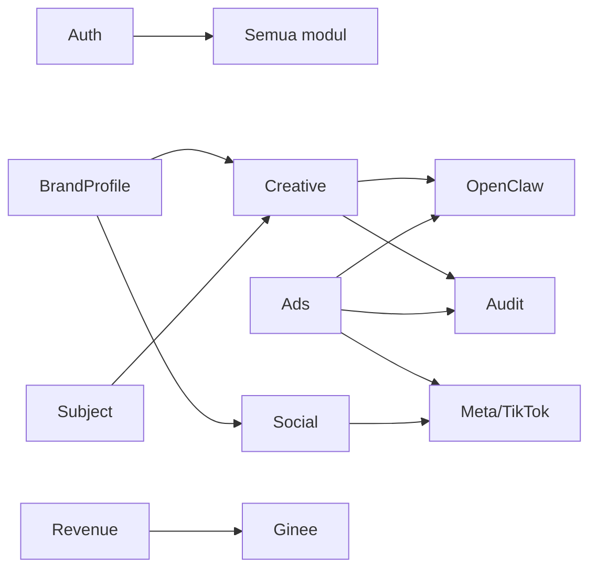
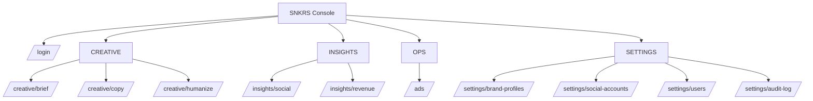

# INFORMATION ARCHITECTURE (IA)
## SNKRS Console — Content & Insights Ops Console

| Meta | Nilai |
|------|-------|
| Versi | 1.0 |
| Status | Baseline |
| Peran | Owner, Member |

---

## Daftar Isi
1. Sitemap
2. Navigation Structure
3. Menu Structure
4. Module Structure
5. Screen Inventory
6. Page Inventory
7. Permission Matrix
8. Taxonomy
9. Content Hierarchy
10. Mobile Navigation
11. Desktop Navigation
12. URL Structure
13. Breadcrumb Strategy
14. Tree Diagram

---

## 1. Sitemap

```
SNKRS Console
├── /login                         (publik)
├── CREATIVE
│   ├── /creative/brief            Content Brief
│   ├── /creative/copy             Copywriting
│   └── /creative/humanize         Humanize
├── INSIGHTS
│   ├── /insights/social           Social Performance
│   └── /insights/revenue          Revenue
├── OPS
│   └── /ads                       Ads Engine (Generate + Performa + Approval)
└── SETTINGS
    ├── /settings/brand-profiles   Brand Profiles
    ├── /settings/social-accounts  Social Accounts   (Owner)
    ├── /settings/users            Users             (Owner)
    └── /settings/audit-log        Audit Log         (Owner)
```

---

## 2. Navigation Structure

### 2.1 Navigasi Berdasarkan Peran
- **Owner**: semua menu (CREATIVE, INSIGHTS, OPS, SETTINGS penuh).
- **Member**: CREATIVE, INSIGHTS, OPS (tanpa approve), SETTINGS terbatas (Brand Profiles buat/edit).

### 2.2 Navigasi Global (Semua Peran)
- Top bar: Brand Profile switcher (section creative/social), Subject chip, menu profil (Ganti Password, Logout).
- Left rail: grup CREATIVE / INSIGHTS / OPS / SETTINGS.

### 2.3 Pola Navigasi
- Persistent left rail (desktop), collapsible/drawer (mobile).
- Active Tag bar persisten di section CREATIVE.
- Brand switcher hanya muncul di CREATIVE & Social.

---

## 3. Menu Structure

### 3.1 Menu Owner
```
CREATIVE
  - Content Brief
  - Copywriting
  - Humanize
INSIGHTS
  - Social Performance
  - Revenue
OPS
  - Ads Engine
SETTINGS
  - Brand Profiles
  - Social Accounts
  - Users
  - Audit Log
```

### 3.2 Menu Member
```
CREATIVE
  - Content Brief
  - Copywriting
  - Humanize
INSIGHTS
  - Social Performance
  - Revenue
OPS
  - Ads Engine (tanpa Approve)
SETTINGS
  - Brand Profiles (buat/edit)
```

### 3.3 Menu Profil (Dropdown — Semua Peran)
- Ganti Password
- Logout

---

## 4. Module Structure

### 4.1 Peta Modul Sistem
| Modul | Fungsi |
|-------|--------|
| Auth | Login, sesi, ganti password |
| User | Kelola Member (Owner) |
| BrandProfile | CRUD profile + set default |
| Subject | Input produk/campaign |
| Creative | content-brief, copywriting, humanize, content-drop |
| Ads | generate, performance, approval |
| Social | connect + performance |
| Revenue | Ginee aggregation |
| Audit | log Generation & aksi |
| OpenClaw (client) | proxy skill generatif |

### 4.2 Dependency Antar Modul


---

## 5. Screen Inventory

### 5.1 Halaman Publik (Tanpa Login)
| Screen | Path |
|--------|------|
| Login | /login |

### 5.2 Halaman CREATIVE
| Screen | Path | Akses |
|--------|------|-------|
| Content Brief | /creative/brief | Owner, Member |
| Copywriting | /creative/copy | Owner, Member |
| Humanize | /creative/humanize | Owner, Member |

### 5.3 Halaman INSIGHTS
| Screen | Path | Akses |
|--------|------|-------|
| Social Performance | /insights/social | Owner, Member |
| Revenue | /insights/revenue | Owner, Member |

### 5.4 Halaman OPS
| Screen | Path | Akses |
|--------|------|-------|
| Ads Engine | /ads | Owner, Member (approve = Owner) |

### 5.5 Halaman SETTINGS
| Screen | Path | Akses |
|--------|------|-------|
| Brand Profiles | /settings/brand-profiles | Owner (CRUD), Member (buat/edit) |
| Social Accounts | /settings/social-accounts | Owner |
| Users | /settings/users | Owner |
| Audit Log | /settings/audit-log | Owner |

---

## 6. Page Inventory

### 6.1 Content Brief
- Active Tag (subject), Brand switcher, Format chips, tombol Generate, OutputTag per format, tombol copy, states.

### 6.2 Copywriting
- Toggle goal (organik/ads), Generate, blok Hooks/Caption/CTA/Hashtag (copyable), tombol Humanize semua.

### 6.3 Humanize
- Textarea input, tombol Bikin Natural, OutputTag, toggle before/after.

### 6.4 Ads Engine
- Tab Generate (4 cards) | Tab Performa (tabel klasifikasi) | daftar AdAction pending + ApprovalModal (Owner).

### 6.5 Social Performance
- Brand switcher, tab platform (IG/TikTok), range, metric cards, follower trend, TopPostsGrid, empty (belum connect).

### 6.6 Revenue
- Date picker, refresh, metric cards (revenue/order/AOV), TopSKU, ChannelBars, TrendBars, AnomalyBadge.

### 6.7 Brand Profiles
- List profile, drawer form (fields profile), set default (Owner), hapus (Owner).

---

## 7. Permission Matrix

### 7.1 CREATIVE
| Halaman/Aksi | Owner | Member |
|--------------|:-----:|:------:|
| Content Brief | ✅ | ✅ |
| Copywriting | ✅ | ✅ |
| Humanize | ✅ | ✅ |
| Content Drop | ✅ | ✅ |

### 7.2 INSIGHTS
| Halaman/Aksi | Owner | Member |
|--------------|:-----:|:------:|
| Social Performance (lihat) | ✅ | ✅ |
| Revenue (lihat) | ✅ | ✅ |

### 7.3 OPS — Ads
| Aksi | Owner | Member |
|------|:-----:|:------:|
| Generate variant | ✅ | ✅ |
| Performance (read) | ✅ | ✅ |
| Ajukan aksi (pending) | ✅ | ✅ |
| Approve/eksekusi aksi berbayar | ✅ | ❌ |

### 7.4 SETTINGS
| Aksi | Owner | Member |
|------|:-----:|:------:|
| Brand Profile — buat/edit | ✅ | ✅ |
| Brand Profile — hapus/set default | ✅ | ❌ |
| Social Accounts — connect/disconnect | ✅ | ❌ |
| Users — kelola | ✅ | ❌ |
| Audit Log — lihat | ✅ | ❌ |

---

## 8. Taxonomy

### 8.1 Taksonomi Section
| Section | Isi |
|---------|-----|
| CREATIVE | Content Brief, Copywriting, Humanize |
| INSIGHTS | Social Performance, Revenue |
| OPS | Ads Engine |
| SETTINGS | Brand Profiles, Social Accounts, Users, Audit Log |

### 8.2 Taksonomi Skill
| Skill | Tipe |
|-------|------|
| content-brief | generatif |
| copywriting | generatif |
| humanize-ai | generatif |
| ads-generate | generatif |
| content-drop | orchestrator |
| revenue / social | data (non-LLM) |

### 8.3 Taksonomi Status
| Domain | Status |
|--------|--------|
| Generation | pending / done / error |
| AdAction | pending_approval / approved / executed / rejected |
| ContentPack | processing / done / error |
| SocialAccount | connected / disconnected |

### 8.4 Taksonomi Peran
| Peran | Deskripsi |
|-------|-----------|
| Owner | Akses penuh + approval + kelola user/secret |
| Member | Operasional kreatif & insights, tanpa approval/manajemen |

### 8.5 Taksonomi Format Konten
carousel · story · short_video · static_ad · long_video · thread · email · blog

---

## 9. Content Hierarchy

### 9.1 Content Brief
```
Panel Content Brief
├── Active Tag (subject)
├── Brand switcher
├── Format chips (multi-select)
├── Tombol Generate
└── Output
    └── OutputTag[] (per format)
        ├── Header mono (brand·SKU·harga·drop)
        ├── Isi brief
        └── Tombol copy
```

### 9.2 Revenue
```
Panel Revenue
├── Date picker + Refresh
├── Metric cards (Revenue ▲/▼, Order, AOV)
├── Top SKU (list)
├── Per Channel (bars)
├── Tren 7 hari (bars)
└── Anomali badge
```

### 9.3 Social Performance
```
Panel Social Performance
├── Brand switcher + Platform tabs (IG/TikTok) + Range
├── Metric cards (Followers ▲, Reach, Engagement, Profile Visits)
├── Follower growth (trend)
└── Top Posts (grid: thumbnail + reach + engagement)
```

---

## 10. Mobile Navigation

### 10.1 Pola Mobile
- Left rail jadi hamburger drawer.
- Bottom nav opsional untuk section utama.
- Active Tag collapsible.

### 10.2 Bottom Navigation (Mobile)
| Ikon | Tujuan |
|------|--------|
| Brief | /creative/brief |
| Insights | /insights/revenue |
| Ads | /ads |
| Menu | drawer (settings, profil) |

### 10.3 Mobile Interaction Rules
- Semua tombol full-width; target tap ≥44px.
- OutputTag stack 1 kolom.

---

## 11. Desktop Navigation

### 11.1 Pola Desktop
- Left rail tetap (grup section), item aktif bar `--flash`.
- Top bar: Brand switcher + Subject chip + profil.

### 11.2 Layout Desktop
```
┌──────────┬──────────────────────────────────┐
│  Rail    │  Topbar (brand · subject · user)  │
│ (grup    │──────────────────────────────────│
│  nav)    │  Active Tag (creative)            │
│          │  Panel body                       │
└──────────┴──────────────────────────────────┘
```

### 11.3 Sidebar Behavior
- Collapsible ke icon-only (tablet).

---

## 12. URL Structure

### 12.1 Konvensi
- Lowercase, kebab-case, resource-based.
- Section sebagai prefix (`/creative`, `/insights`, `/settings`).

### 12.2 Halaman
| URL | Halaman |
|-----|---------|
| /login | Login |
| /creative/brief | Content Brief |
| /creative/copy | Copywriting |
| /creative/humanize | Humanize |
| /insights/social | Social Performance |
| /insights/revenue | Revenue |
| /ads | Ads Engine |
| /settings/brand-profiles | Brand Profiles |
| /settings/social-accounts | Social Accounts |
| /settings/users | Users |
| /settings/audit-log | Audit Log |

### 12.3 API Endpoint (Referensi)
| Method | Endpoint |
|--------|----------|
| POST | /api/auth/login |
| POST | /api/auth/logout |
| POST | /api/creative/content-brief |
| POST | /api/creative/copywriting |
| POST | /api/creative/humanize |
| POST | /api/creative/content-drop |
| GET | /api/creative/content-drop/:id |
| CRUD | /api/brand-profiles |
| POST | /api/ads/generate |
| GET | /api/ads/performance |
| POST | /api/ads/actions/:id/approve |
| GET | /api/revenue |
| POST | /api/revenue/cache |
| GET | /api/social/performance |
| GET/POST/DELETE | /api/social/accounts |
| CRUD | /api/users |
| GET | /api/audit-log |

---

## 13. Breadcrumb Strategy

### 13.1 Aturan
- Format: `Section › Halaman [ › Detail ]`.
- Root section tidak clickable; halaman clickable.

### 13.2 Contoh
| Halaman | Breadcrumb |
|---------|-----------|
| Content Brief | Creative › Content Brief |
| Revenue | Insights › Revenue |
| Ads Engine | Ops › Ads Engine |
| Brand Profiles | Settings › Brand Profiles |

---

## 14. Tree Diagram



---

## Requirement Log
| Item | Referensi SRS | Status |
|------|---------------|--------|
| Sitemap & routes | Section 3, 7 | Baseline |
| Permission matrix | SRS Section 10 | Baseline |
| URL structure | Section 3.3 | Baseline |
| 2 peran | Owner/Member | Baseline |
