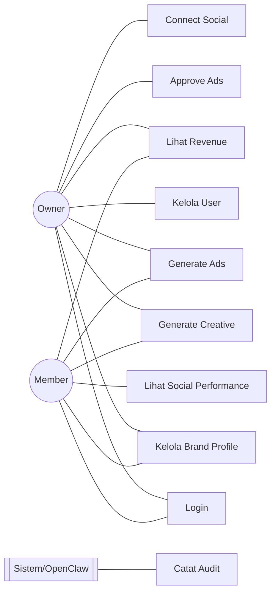
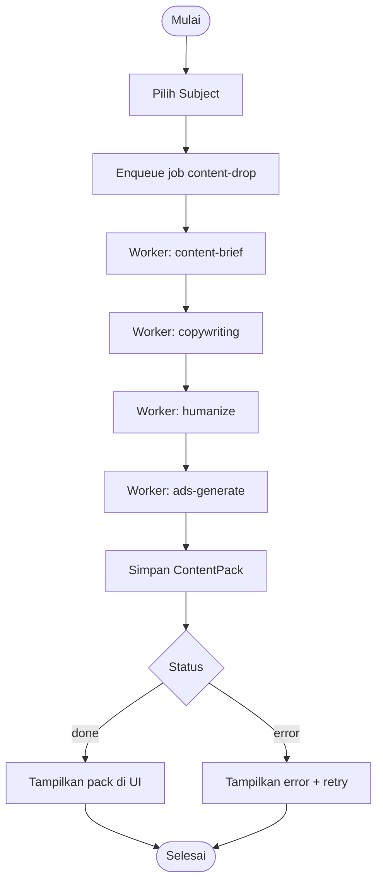
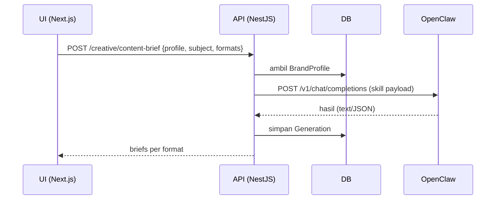
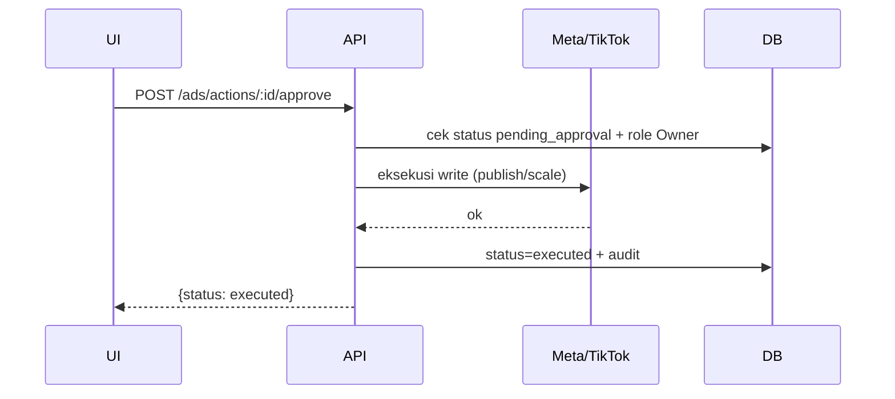
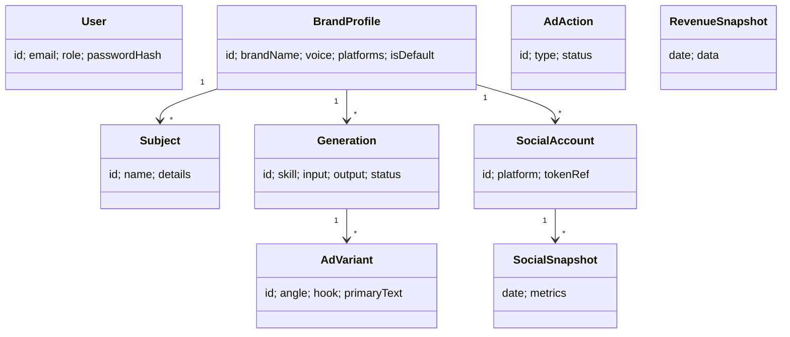
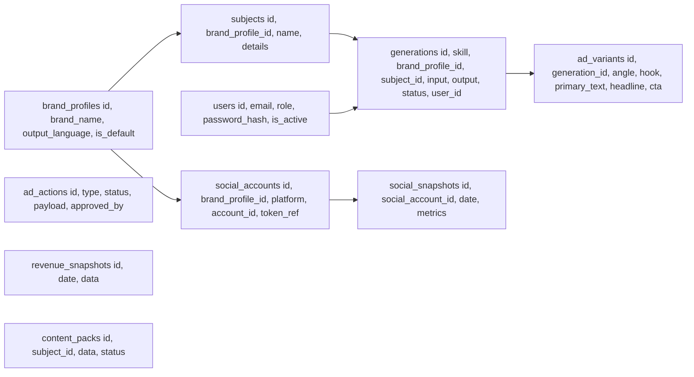

# SOFTWARE REQUIREMENT SPECIFICATION (SRS)
## SNKRS Console — Content & Insights Ops Console

| Meta | Nilai |
|------|-------|
| Versi | 1.0 |
| Status | Baseline |
| Standar | IEEE 29148 (modern) |
| Bahasa Output Sistem | Bahasa Indonesia (informal) + istilah English umum |
| Platform | Web (responsive) |

---

## Daftar Isi
1. Pendahuluan
2. Tujuan Sistem
3. Ruang Lingkup
4. Analisis Stakeholder
5. Proses As-Is
6. Proses To-Be
7. Kebutuhan Fungsional
8. Kebutuhan Non-Fungsional
9. Business Rules
10. Matriks Peran Pengguna
11. Spesifikasi Use Case
12. Dokumentasi UML
13. Model Data
14. ERD
15. Logical Relational Schema (LRS)
16. Database Schema (Prisma)
17. Data Dictionary
18. Matriks Notifikasi
19. Kebutuhan Keamanan
20. Kebutuhan Audit Log
21. Kebutuhan Pelaporan
22. Kriteria Penerimaan
23. Risk Analysis
24. Assumptions & Constraints
25. Future Enhancements

---

## 1. Pendahuluan

### 1.1 Tujuan Dokumen
Dokumen ini mendefinisikan kebutuhan lengkap SNKRS Console — web app internal untuk mengotomatisasi kerja kreatif (content brief, copywriting, humanize, ad variant) dan insights (social performance, revenue) untuk SneakersFlash dan brand lain via Brand Profile. Dokumen menjadi Source of Truth untuk seluruh proses coding.

### 1.2 Audiens Dokumen
- Owner / Product Owner (SF)
- Developer (Claude Code agent)
- Tim kreatif & ops SNKRS Flash

### 1.3 Definisi, Akronim, dan Singkatan

| Istilah | Keterangan |
|---------|-----------|
| Console | SNKRS Console, aplikasi web ini |
| OpenClaw | Agent runtime yang menjalankan skill generatif |
| Skill | Unit instruksi generatif (SKILL.md) di OpenClaw |
| Brand Profile | Konteks brand (voice/audience/platform) yang dapat di-swap |
| Subject | Produk/campaign yang dijadikan bahan konten |
| Ginee | Platform omnichannel e-commerce (sumber revenue) |
| Ad Variant | Konsep iklan yang di-generate |
| Content Pack | Paket konten gabungan hasil orchestrator content-drop |
| Owner | Peran pemilik dengan akses penuh |
| Member | Peran tim dengan akses terbatas |
| SOT | Source of Truth |

---

## 2. Tujuan Sistem

### 2.1 Pernyataan Tujuan
Menyediakan satu dashboard web bagi tim SNKRS Flash untuk memproduksi materi kreatif dan memantau performa (social + revenue) secara cepat, konsisten, dan terpusat — dengan otak generatif OpenClaw dan akses aman lewat backend tunggal.

### 2.2 Tujuan Spesifik
1. Memotong waktu prep konten drop dari jam menjadi menit.
2. Menjaga konsistensi brand voice melalui skill + humanize yang seragam.
3. Menyatukan konten, ads, social, dan revenue dalam satu tempat.
4. Reusable lintas brand melalui Brand Profile.
5. Mencegah kesalahan mahal (ads spend) lewat approval manual.

---

## 3. Ruang Lingkup

### 3.1 Dalam Lingkup (In Scope)
- Autentikasi login sederhana (akun dibuat manual oleh Owner).
- Manajemen Brand Profile & Subject.
- Skill kreatif: content-brief, copywriting, humanize, content-drop.
- Ads: generate variant (MODE A), performance review (MODE B, read-only), approval gate.
- Social Performance (IG & TikTok organik).
- Revenue dashboard (sumber Ginee).
- Manajemen user (Owner mengelola Member).
- Audit log Generation.

### 3.2 Luar Lingkup (Out of Scope)
- Registrasi mandiri, MFA, email verification.
- Auto-publish konten ke IG/TikTok/Shopee.
- Roles/permission kompleks (>2 peran).
- Multi-tenant penuh untuk klien eksternal.
- Scheduling konten otomatis penuh.
- Light mode.

### 3.3 Lingkungan Sistem

| Komponen | Teknologi |
|----------|-----------|
| Frontend | Next.js (App Router), React, TypeScript, Tailwind |
| Backend | NestJS, TypeScript, Prisma |
| Database | PostgreSQL (console-owned) |
| Cache/Queue | Redis + BullMQ |
| Agent | OpenClaw Gateway (`/v1/chat/completions`) |
| Integrasi | Ginee OpenAPI, Meta (IG Graph + Marketing), TikTok Business API |
| Infra | Docker + docker-compose, GitHub |

---

## 4. Analisis Stakeholder

### 4.1 Identifikasi Stakeholder

| Stakeholder | Peran | Kepentingan |
|-------------|-------|-------------|
| Owner (SF) | Pemilik & admin | Kontrol penuh, keputusan strategis, keamanan |
| Member (tim kreatif/ops) | Operator harian | Produksi konten & lihat insights |
| OpenClaw Gateway | Sistem | Menjalankan skill generatif |
| Ginee / Meta / TikTok | Sistem eksternal | Sumber data revenue, ads, social |

### 4.2 Kebutuhan Stakeholder
- Owner: manajemen user, kontrol approval ads, keamanan secret, kelola Brand Profile.
- Member: akses cepat ke skill kreatif & insights tanpa ribet.
- Sistem eksternal: integrasi aman via backend (secret di server).

---

## 5. Proses As-Is

### 5.1 Deskripsi Proses Saat Ini
Konten dibuat manual/ad-hoc, copywriting dikerjakan tangan, prompt AI dijalankan lepas-lepas tanpa brand voice konsisten. Revenue dicek terpisah di tiap marketplace/Ginee. Performa social dilihat manual per platform.

### 5.2 Permasalahan As-Is
- Prep konten drop lambat & tidak konsisten.
- Brand voice berubah-ubah antar admin.
- Data revenue & social tersebar, tidak satu layar.
- Tidak ada log/kontrol untuk output AI.

---

## 6. Proses To-Be

### 6.1 Alur Proses Baru
Tim login → pilih Brand Profile + Subject → generate brief/copy/humanize/ads dari satu console → lihat social & revenue di panel Insights → aksi berbayar (ads) lewat approval. Semua generatif lewat OpenClaw, data lewat backend.

### 6.2 Perbaikan Proses
- Otomasi kreatif terstandar (skill + humanize).
- Insight tersentral (Ginee revenue + IG/TikTok social).
- Kontrol & audit (Generation log + approval gate).

---

## 7. Kebutuhan Fungsional

### 7.1 Modul Autentikasi

| Kode | Fitur | Aktor | Deskripsi |
|------|-------|-------|-----------|
| AUTH-01 | Login | Owner, Member | Login via email + password |
| AUTH-02 | Logout | Owner, Member | Keluar & akhiri sesi |
| AUTH-03 | Change Password | Owner, Member | Ganti password sendiri |
| AUTH-04 | Session Expiry | Sistem | Sesi berakhir setelah idle |

### 7.2 Modul Manajemen Pengguna

| Kode | Fitur | Aktor | Deskripsi |
|------|-------|-------|-----------|
| USER-01 | Tambah Member | Owner | Buat akun Member (email + password sementara) |
| USER-02 | Nonaktifkan Member | Owner | Menonaktifkan akun Member |
| USER-03 | Daftar Pengguna | Owner | Lihat semua user |

### 7.3 Modul Brand Profile

| Kode | Fitur | Aktor | Deskripsi |
|------|-------|-------|-----------|
| BRAND-01 | Tambah Brand Profile | Owner, Member | Buat profile baru |
| BRAND-02 | Edit Brand Profile | Owner, Member | Ubah voice/audience/platform |
| BRAND-03 | Hapus Brand Profile | Owner | Hanya Owner |
| BRAND-04 | Set Default | Owner | Tetapkan profile default (SNKRS Flash) |
| BRAND-05 | Pilih Profile Aktif | Owner, Member | Switch profile untuk sesi kerja |

### 7.4 Modul Subject

| Kode | Fitur | Aktor | Deskripsi |
|------|-------|-------|-----------|
| SUBJ-01 | Input Subject | Owner, Member | Isi produk/campaign (nama, detail, drop type) |
| SUBJ-02 | Simpan Subject | Owner, Member | Simpan untuk dipakai lintas panel |

### 7.5 Modul Creative

| Kode | Fitur | Aktor | Deskripsi |
|------|-------|-------|-----------|
| CRE-01 | Content Brief | Owner, Member | Generate brief per format (carousel/story/reel/ad/dll) |
| CRE-02 | Copywriting | Owner, Member | Generate hook/caption/CTA/hashtag |
| CRE-03 | Humanize | Owner, Member | Rewrite copy jadi natural |
| CRE-04 | Content Drop | Owner, Member | Orchestrator: brief+copy+humanize+ads (async) |
| CRE-05 | Copy Output | Owner, Member | Salin hasil ke clipboard |

### 7.6 Modul Ads

| Kode | Fitur | Aktor | Deskripsi |
|------|-------|-------|-----------|
| ADS-01 | Generate Variant | Owner, Member | 4 ad concept (scarcity/price/styling/social proof) |
| ADS-02 | Performance Review | Owner, Member | Klasifikasi winner/ok/loser (read-only) |
| ADS-03 | Ajukan Aksi | Owner, Member | Buat rencana publish/scale (status pending) |
| ADS-04 | Approve Aksi | Owner | Menyetujui & eksekusi aksi berbayar |

### 7.7 Modul Social Performance

| Kode | Fitur | Aktor | Deskripsi |
|------|-------|-------|-----------|
| SOC-01 | Connect Akun | Owner | Hubungkan IG/TikTok (OAuth) per Brand Profile |
| SOC-02 | Disconnect Akun | Owner | Putuskan akun |
| SOC-03 | Lihat Performa | Owner, Member | Followers, reach, engagement, top posts |

### 7.8 Modul Revenue

| Kode | Fitur | Aktor | Deskripsi |
|------|-------|-------|-----------|
| REV-01 | Lihat Revenue | Owner, Member | Revenue, order, AOV, top SKU, per channel |
| REV-02 | Refresh | Owner, Member | Tarik ulang dari Ginee |
| REV-03 | Deteksi Anomali | Sistem | Highlight anomali (turun >30% dll) |

### 7.9 Modul Audit Log

| Kode | Fitur | Aktor | Deskripsi |
|------|-------|-------|-----------|
| AUD-01 | Catat Generation | Sistem | Log tiap skill run (input/output/user) |
| AUD-02 | Lihat Log | Owner | Lihat riwayat Generation & aksi ads |

#### Status Generation

| Status | Keterangan |
|--------|-----------|
| pending | Sedang diproses |
| done | Selesai |
| error | Gagal |

#### Status Ad Action

| Status | Keterangan |
|--------|-----------|
| pending_approval | Menunggu approval Owner |
| approved | Disetujui |
| executed | Sudah dieksekusi |
| rejected | Ditolak |

---

## 8. Kebutuhan Non-Fungsional

### 8.1 Performa
- Respon endpoint data (revenue/social, cached) < 800ms.
- Skill generatif tampilkan loading; timeout wajar (mis. 60s).
- content-drop diproses async (BullMQ).

### 8.2 Keamanan
- UI tidak pernah akses OpenClaw/Ginee/DB langsung.
- Secret hanya di env server; tidak ke frontend/commit.
- Password di-hash (bcrypt/argon2).
- Token OAuth social encrypted at rest.

### 8.3 Ketersediaan & Reliabilitas
- Snapshot cache (revenue/social) agar tahan rate limit sumber.
- Error state jelas + retry di tiap panel.

### 8.4 Usabilitas
- Responsive sampai mobile; rupiah format ribuan.
- Microcopy Bahasa Indonesia pro-informal.
- `prefers-reduced-motion` dihormati.

### 8.5 Skalabilitas
- Modular NestJS per fitur; siap tambah Brand Profile & akun social.

---

## 9. Business Rules

| Kode | Business Rule |
|------|--------------|
| BR-01 | Skill generatif dipanggil **via OpenClaw Gateway**, prompt tidak di-hardcode di backend |
| BR-02 | UI **tidak pernah** akses OpenClaw / Ginee / DB langsung — selalu lewat NestJS |
| BR-03 | Ads write action (publish/scale) **wajib approval manual** oleh Owner |
| BR-04 | Kenaikan budget ads **> 30%** butuh konfirmasi ulang |
| BR-05 | Revenue **mengecualikan** order berstatus Cancelled/Returned |
| BR-06 | Section CREATIVE **brand-profile driven**; OPS (Ads, Revenue) scope SNKRS Flash |
| BR-07 | Token OAuth social **encrypted**, hanya `tokenRef` di DB |
| BR-08 | Akun dibuat **manual oleh Owner**; tidak ada registrasi mandiri |
| BR-09 | Owner-only: kelola user, hapus Brand Profile, approve ads, connect social |
| BR-10 | Sesi berakhir setelah **idle** (default 8 jam) |
| BR-11 | Secret hanya di env server |
| BR-12 | Setiap Generation **wajib dicatat** (audit) |
| BR-13 | Brand Profile default = **SNKRS Flash** |
| BR-14 | content-drop dijalankan **async** (BullMQ) |
| BR-15 | Query revenue bersifat **read-only** |
| BR-16 | Output konten menghadap-customer **wajib Bahasa Indonesia** (kecuali istilah sneaker English) |
| BR-17 | Tidak ada auto-publish; publish tetap manual |

---

## 10. Matriks Peran Pengguna

| Fitur | Owner | Member |
|-------|:-----:|:------:|
| Login / Change Password | ✅ | ✅ |
| Kelola User | ✅ | ❌ |
| Brand Profile (buat/edit) | ✅ | ✅ |
| Brand Profile (hapus/set default) | ✅ | ❌ |
| Content Brief / Copy / Humanize | ✅ | ✅ |
| Content Drop | ✅ | ✅ |
| Ads Generate / Performance (read) | ✅ | ✅ |
| Ads Approve (aksi berbayar) | ✅ | ❌ |
| Social — Connect/Disconnect | ✅ | ❌ |
| Social — Lihat Performa | ✅ | ✅ |
| Revenue — Lihat | ✅ | ✅ |
| Audit Log | ✅ | ❌ |

---

## 11. Spesifikasi Use Case

### UC-01: Login
| Atribut | Detail |
|---------|--------|
| **ID** | UC-01 |
| **Aktor** | Owner, Member |
| **Trigger** | Pengguna membuka console |
| **Precondition** | Akun aktif sudah dibuat Owner |
| **Main Flow** | 1. Buka halaman login |
| | 2. Input email + password |
| | 3. Sistem verifikasi kredensial |
| | 4. Sesi dibuat, redirect ke Content Brief |
| **Exception Flow** | E1: Kredensial salah → tampilkan error |
| **Post Condition** | Pengguna terautentikasi |

### UC-02: Generate Content Brief
| Atribut | Detail |
|---------|--------|
| **ID** | UC-02 |
| **Aktor** | Owner, Member |
| **Trigger** | Pilih format & klik Generate |
| **Precondition** | Login; Brand Profile & Subject terisi |
| **Main Flow** | 1. Pilih Brand Profile aktif |
| | 2. Isi/pilih Subject |
| | 3. Pilih format (carousel/story/reel/ad/dll) |
| | 4. Klik Generate |
| | 5. Backend susun payload → OpenClaw |
| | 6. Parse hasil → tampil sebagai OutputTag |
| | 7. Simpan Generation (audit) |
| **Alternative Flow** | A1: Brand Profile kosong → minta pilih dulu |
| **Exception Flow** | E1: OpenClaw gagal → error + retry |
| **Post Condition** | Brief tampil, bisa di-copy |

### UC-03: Approve Aksi Ads
| Atribut | Detail |
|---------|--------|
| **ID** | UC-03 |
| **Aktor** | Owner |
| **Trigger** | Ada AdAction status pending_approval |
| **Precondition** | Login sebagai Owner |
| **Main Flow** | 1. Buka daftar aksi pending |
| | 2. Review rencana (budget/target) |
| | 3. Klik Approve |
| | 4. Sistem eksekusi write ke Meta/TikTok |
| | 5. Status → executed; catat audit |
| **Exception Flow** | E1: Budget naik >30% → konfirmasi ulang |
| | E2: Bukan Owner → aksi ditolak |
| **Post Condition** | Aksi tereksekusi & tercatat |

### UC-04: Lihat Revenue (Ginee)
| Atribut | Detail |
|---------|--------|
| **ID** | UC-04 |
| **Aktor** | Owner, Member |
| **Trigger** | Buka panel Revenue |
| **Precondition** | Login |
| **Main Flow** | 1. Pilih tanggal |
| | 2. Backend cek cache snapshot |
| | 3. Jika stale → tarik order Ginee (skip cancelled) |
| | 4. Agregasi by channel → tampil metrik |
| **Post Condition** | Revenue tampil + delta + anomali |

---

## 12. Dokumentasi UML

### 12.1 Use Case Diagram


### 12.2 Activity Diagram — Content Drop


### 12.3 Sequence Diagram — Generate Content Brief


### 12.4 Sequence Diagram — Approve Ads


### 12.5 Class Diagram (ringkas)


---

## 13. Model Data

### 13.1 Entitas Utama
User, BrandProfile, Subject, Generation, AdVariant, AdAction, RevenueSnapshot, ContentPack, SocialAccount, SocialSnapshot.

---

## 14. ERD
```mermaid
erDiagram
  USER ||--o{ GENERATION : "creates"
  BRAND_PROFILE ||--o{ SUBJECT : "has"
  BRAND_PROFILE ||--o{ GENERATION : "context"
  BRAND_PROFILE ||--o{ SOCIAL_ACCOUNT : "owns"
  SUBJECT ||--o{ GENERATION : "about"
  GENERATION ||--o{ AD_VARIANT : "produces"
  SOCIAL_ACCOUNT ||--o{ SOCIAL_SNAPSHOT : "tracked"

  USER { string id PK; string email UK; string role; string passwordHash; bool isActive }
  BRAND_PROFILE { string id PK; string brandName; string outputLanguage; bool isDefault }
  SUBJECT { string id PK; string brandProfileId FK; string name; json details }
  GENERATION { string id PK; string skill; string brandProfileId FK; string subjectId FK; json input; json output; string status }
  AD_VARIANT { string id PK; string generationId FK; string angle; string hook }
  AD_ACTION { string id PK; string type; string status; json payload }
  REVENUE_SNAPSHOT { string id PK; date date UK; json data }
  CONTENT_PACK { string id PK; string subjectId FK; json data; string status }
  SOCIAL_ACCOUNT { string id PK; string brandProfileId FK; string platform; string tokenRef }
  SOCIAL_SNAPSHOT { string id PK; string socialAccountId FK; date date; json metrics }
```

---

## 15. Logical Relational Schema (LRS)


---

## 16. Database Schema (Prisma)

Lihat `MASTER-BRIEF.md` untuk skema penuh. Ringkas — 10 model: `User, BrandProfile, Subject, Generation, AdVariant, AdAction, RevenueSnapshot, ContentPack, SocialAccount, SocialSnapshot`. Semua ID `cuid`, timestamp `createdAt/updatedAt`, relasi sesuai ERD Section 14.

---

## 17. Data Dictionary

### Tabel: users
| Kolom | Tipe | Null | Keterangan |
|-------|------|------|-----------|
| id | TEXT (cuid) | NO | Primary key |
| email | TEXT | NO | Unik, untuk login |
| name | TEXT | YES | Nama tampilan |
| password_hash | TEXT | NO | Hash bcrypt/argon2 |
| role | TEXT | NO | owner / member |
| is_active | BOOLEAN | NO | Status akun |
| created_at | TIMESTAMP | NO | Waktu dibuat |

### Tabel: brand_profiles
| Kolom | Tipe | Null | Keterangan |
|-------|------|------|-----------|
| id | TEXT | NO | PK |
| brand_name | TEXT | NO | Nama brand |
| audience | TEXT | YES | Audiens |
| voice_adjectives / voice_do / voice_dont | TEXT | YES | Voice & tone |
| platforms | TEXT[] | NO | Channel |
| output_language | TEXT | NO | Default id-ID |
| is_default | BOOLEAN | NO | Profile default |

### Tabel: generations
| Kolom | Tipe | Null | Keterangan |
|-------|------|------|-----------|
| id | TEXT | NO | PK |
| skill | TEXT | NO | content-brief/copywriting/humanize/ads-generate/content-drop |
| brand_profile_id | TEXT | YES | FK |
| subject_id | TEXT | YES | FK |
| input | JSONB | NO | Payload input |
| output | JSONB | NO | Hasil |
| status | TEXT | NO | pending/done/error |
| user_id | TEXT | YES | Aktor |

### Tabel: ad_actions
| Kolom | Tipe | Null | Keterangan |
|-------|------|------|-----------|
| id | TEXT | NO | PK |
| type | TEXT | NO | publish / scale |
| payload | JSONB | NO | Detail aksi |
| status | TEXT | NO | pending_approval/approved/executed/rejected |
| approved_by | TEXT | YES | FK user (Owner) |

### Tabel: social_accounts
| Kolom | Tipe | Null | Keterangan |
|-------|------|------|-----------|
| id | TEXT | NO | PK |
| brand_profile_id | TEXT | NO | FK |
| platform | TEXT | NO | instagram / tiktok |
| account_id | TEXT | NO | ID akun |
| token_ref | TEXT | NO | Referensi secret (token TIDAK plain) |

---

## 18. Matriks Notifikasi

| Kode | Event | Penerima | Channel |
|------|-------|----------|---------|
| NOTIF-01 | Generation selesai | User pemicu | In-app toast |
| NOTIF-02 | Generation gagal | User pemicu | In-app toast |
| NOTIF-03 | content-drop selesai | User pemicu | In-app + badge |
| NOTIF-04 | Ad action perlu approval | Owner | In-app badge |
| NOTIF-05 | Anomali revenue terdeteksi | Owner, Member | In-app badge di panel Revenue |

> Console tidak mengirim WA/Telegram/SMS. Notifikasi utama = in-app. (Email digest opsional, future enhancement.)

---

## 19. Kebutuhan Keamanan
- Login + password hash; sesi expiry idle 8 jam.
- RBAC 2 peran (Owner/Member) sesuai Matriks Section 10.
- Secret di env server; OpenClaw Gateway di network internal (tanpa publish port).
- Token OAuth social encrypted at rest.
- Approval gate untuk aksi ads berbayar.
- Rate limit endpoint generatif.
- Console tidak di-expose publik (behind reverse proxy + auth/VPN).

---

## 20. Kebutuhan Audit Log

### 20.1 Data yang Dicatat
Aktor, skill/aksi, input ringkas, status, timestamp.

### 20.2 Daftar Aktivitas Ter-log
| Kode | Aktivitas |
|------|-----------|
| LOG-01 | GENERATION_CREATED |
| LOG-02 | GENERATION_ERROR |
| LOG-03 | AD_ACTION_CREATED |
| LOG-04 | AD_ACTION_APPROVED / EXECUTED |
| LOG-05 | BRAND_PROFILE_CHANGED |
| LOG-06 | USER_CREATED / DEACTIVATED |
| LOG-07 | SOCIAL_ACCOUNT_CONNECTED / DISCONNECTED |

---

## 21. Kebutuhan Pelaporan

| Report | Isi | Akses |
|--------|-----|-------|
| Revenue Harian | Revenue, order, AOV, top SKU, per channel, anomali | Owner, Member |
| Social Performance | Followers, reach, engagement, top posts | Owner, Member |
| Ads Performance | Klasifikasi winner/ok/loser | Owner, Member |
| Audit Log | Riwayat Generation & aksi | Owner |

---

## 22. Kriteria Penerimaan

| Kode | Kriteria |
|------|----------|
| AC-01 | Login/logout & 2 peran berfungsi sesuai matriks |
| AC-02 | Generate brief/copy/humanize dari web, hasil tampil & bisa di-copy, lewat OpenClaw |
| AC-03 | Ganti Brand Profile mengubah tone output |
| AC-04 | 4 ad variant tampil; aksi berbayar tidak jalan tanpa approve Owner |
| AC-05 | Revenue akurat (skip cancelled) + delta + anomali |
| AC-06 | Social Performance tampil per akun ter-connect per Brand Profile |
| AC-07 | content-drop menghasilkan full pack async |
| AC-08 | Secret tidak pernah bocor ke frontend; token social tidak plain di DB |

---

## 23. Risk Analysis

| Risiko | Dampak | Mitigasi |
|--------|--------|----------|
| OpenClaw Gateway misconfig/ke-expose | Akses tak sah | Network internal, bearer, tanpa publish port |
| Aksi ads salah eksekusi | Budget terbuang | Approval gate wajib + batas +30% |
| Rate limit sumber (Ginee/IG/TikTok) | Data gagal tarik | Snapshot cache + retry |
| Output AI halu/klaim palsu | Kredibilitas | Rules skill (no over-claim) + humanize + review manual |
| Kebocoran secret | Keamanan | Env server, encrypted token, gitignore .env |

---

## 24. Assumptions & Constraints
- OpenClaw Gateway sudah bisa dijalankan Owner + endpoint chatCompletions aktif.
- Kredensial Ginee/Meta/TikTok disediakan Owner.
- Console = repo & DB terpisah dari commerce (revenue via Ginee).
- 2 peran saja (Owner/Member); tidak multi-tenant.

---

## 25. Future Enhancements
- Auto-publish (approval-first) ke IG/TikTok/Shopee.
- Email digest revenue harian.
- Multi-tenant untuk klien/agency.
- Scheduling konten otomatis.
- Light mode.

---

## Requirement Log
| Item | Referensi | Status |
|------|-----------|--------|
| Auth simple login | AUTH-01..04, BR-08 | Baseline |
| 2 roles Owner/Member | Section 10 | Baseline |
| Revenue via Ginee | REV-01, BR-05 | Baseline |
| Social Performance | SOC-01..03 | Baseline |
| Approval gate ads | ADS-04, BR-03 | Baseline |
