# USER FLOW (UF)
## SNKRS Console — Content & Insights Ops Console

| Meta | Nilai |
|------|-------|
| Versi | 1.0 |
| Status | Baseline |
| Peran | Owner, Member |

---

## Daftar Isi
- UF-01: Login
- UF-02: Change Password
- UF-03: Tambah Member (Owner)
- UF-04: Kelola Brand Profile
- UF-05: Pilih Brand Profile & Input Subject
- UF-06: Generate Content Brief
- UF-07: Generate Copywriting
- UF-08: Humanize Copy
- UF-09: Content Drop (Orchestrator)
- UF-10: Generate Ad Variant
- UF-11: Ads Performance Review
- UF-12: Approve Ad Action
- UF-13: Connect Social Account
- UF-14: Lihat Social Performance
- UF-15: Lihat Revenue (Ginee)

---

## UF-01: Login

| Atribut | Detail |
|---------|--------|
| **Flow Name** | Login |
| **Actor** | Owner, Member |
| **Trigger** | Membuka console |
| **Preconditions** | Akun aktif sudah dibuat Owner |
| **Post Conditions** | Sesi terautentikasi; redirect ke Content Brief |

### Main Flow
| Step | Actor | Aksi |
|------|-------|------|
| 1 | User | Buka halaman login |
| 2 | User | Input email + password |
| 3 | Sistem | Verifikasi kredensial + status aktif |
| 4 | Sistem | Buat sesi (JWT/session) |
| 5 | Sistem | Redirect ke `/creative/brief` |

### Exception Flow
| Kode | Kondisi | Aksi |
|------|---------|------|
| E1 | Kredensial salah | Tampilkan: *"Email atau password salah."* |
| E2 | Akun nonaktif | Tampilkan: *"Akun nonaktif. Hubungi owner."* |

### Validation Rules
| Field | Rule |
|-------|------|
| Email | Wajib, format email |
| Password | Wajib |

### Mermaid Flowchart
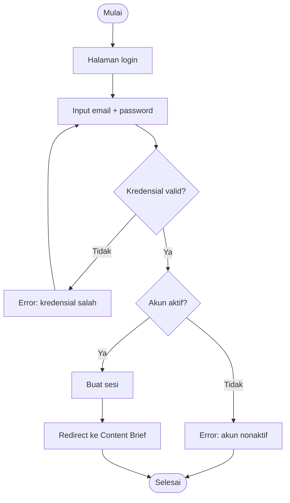

---

## UF-02: Change Password

| Atribut | Detail |
|---------|--------|
| **Actor** | Owner, Member |
| **Trigger** | Buka menu profil → Ganti Password |
| **Preconditions** | Login |
| **Post Conditions** | Password diperbarui |

### Main Flow
| Step | Actor | Aksi |
|------|-------|------|
| 1 | User | Buka Ganti Password |
| 2 | User | Input password lama + baru + konfirmasi |
| 3 | Sistem | Verifikasi password lama |
| 4 | Sistem | Hash & simpan password baru |
| 5 | Sistem | Tampilkan sukses |

### Exception Flow
| Kode | Kondisi | Aksi |
|------|---------|------|
| E1 | Password lama salah | Error |
| E2 | Konfirmasi tidak cocok | Error |

### Mermaid Flowchart
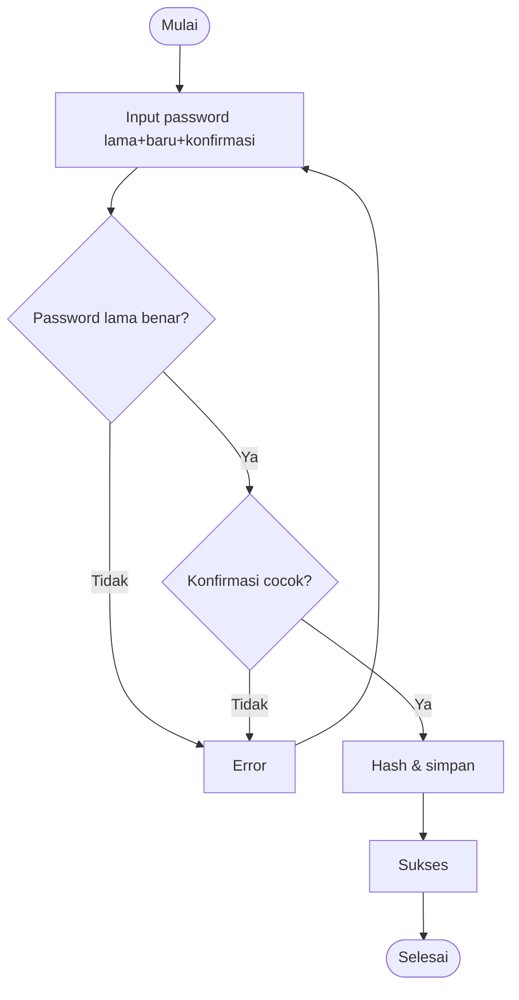

---

## UF-03: Tambah Member (Owner)

| Atribut | Detail |
|---------|--------|
| **Actor** | Owner |
| **Trigger** | Settings → Users → Tambah |
| **Preconditions** | Login sebagai Owner |
| **Post Conditions** | Akun Member dibuat |

### Main Flow
| Step | Actor | Aksi |
|------|-------|------|
| 1 | Owner | Buka Settings → Users |
| 2 | Owner | Klik Tambah Member |
| 3 | Owner | Input email + nama + password sementara |
| 4 | Sistem | Buat akun role=member, is_active=true |
| 5 | Sistem | Catat audit USER_CREATED |

### Exception Flow
| Kode | Kondisi | Aksi |
|------|---------|------|
| E1 | Email sudah ada | Error: email terpakai |
| E2 | Bukan Owner | Akses ditolak |

### Mermaid Flowchart
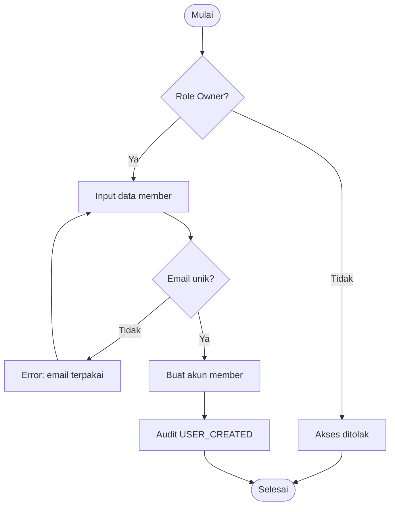

---

## UF-04: Kelola Brand Profile

| Atribut | Detail |
|---------|--------|
| **Actor** | Owner (CRUD penuh), Member (buat/edit) |
| **Trigger** | Settings → Brand Profiles |
| **Preconditions** | Login |
| **Post Conditions** | Profile tersimpan |

### Main Flow — Tambah/Edit
| Step | Actor | Aksi |
|------|-------|------|
| 1 | User | Buka Brand Profiles |
| 2 | User | Klik Tambah / Edit |
| 3 | User | Isi brand_name, audience, voice_tone, platforms, output_language, dll |
| 4 | Sistem | Validasi & simpan |
| 5 | Sistem | Audit BRAND_PROFILE_CHANGED |

### Exception Flow
| Kode | Kondisi | Aksi |
|------|---------|------|
| E1 | Member coba hapus/set default | Aksi disembunyikan/ditolak (Owner only) |

### Validation Rules
| Field | Rule |
|-------|------|
| brand_name | Wajib |
| output_language | Wajib (default id-ID) |
| platforms | Minimal 1 |

### Mermaid Flowchart
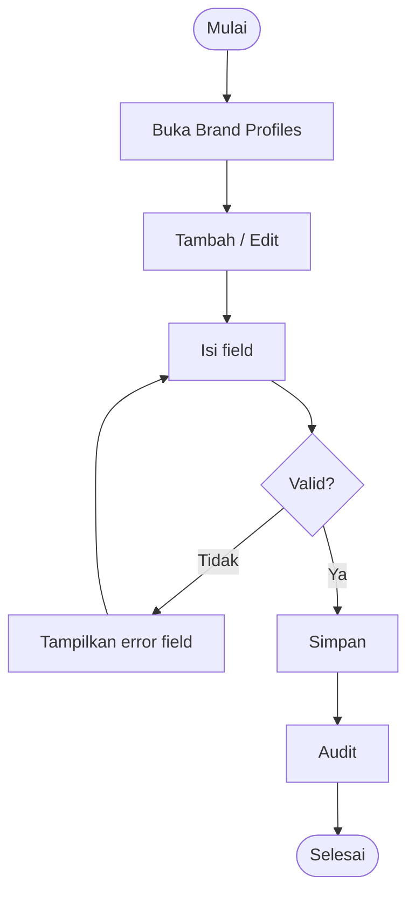

---

## UF-05: Pilih Brand Profile & Input Subject

| Atribut | Detail |
|---------|--------|
| **Actor** | Owner, Member |
| **Trigger** | Buka section CREATIVE |
| **Preconditions** | Login; minimal 1 Brand Profile ada |
| **Post Conditions** | Profile aktif + Subject siap dipakai lintas panel |

### Main Flow
| Step | Actor | Aksi |
|------|-------|------|
| 1 | User | Pilih Brand Profile via switcher (default terpilih) |
| 2 | User | Isi Active Tag: nama produk, detail (SKU/colorway/harga), drop type |
| 3 | Sistem | Simpan Subject (session/DB) |

### Mermaid Flowchart
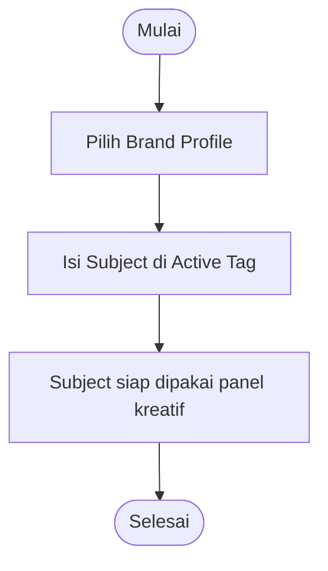

---

## UF-06: Generate Content Brief

| Atribut | Detail |
|---------|--------|
| **Actor** | Owner, Member |
| **Trigger** | Panel Content Brief → Generate |
| **Preconditions** | Login; Brand Profile aktif; Subject terisi |
| **Post Conditions** | Brief tampil sebagai OutputTag; Generation tercatat |

### Main Flow
| Step | Actor | Aksi |
|------|-------|------|
| 1 | User | Pilih format (carousel/story/reel/ad/thread/email/blog) |
| 2 | User | Klik Generate |
| 3 | Sistem | Susun payload (profile + subject + formats) |
| 4 | Sistem | POST OpenClaw `/v1/chat/completions` |
| 5 | Sistem | Parse hasil per format |
| 6 | Sistem | Simpan Generation + tampil OutputTag |

### Alternative Flow
| Kode | Kondisi | Aksi |
|------|---------|------|
| A1 | Subject kosong | Minta isi Subject dulu |

### Exception Flow
| Kode | Kondisi | Aksi |
|------|---------|------|
| E1 | OpenClaw gagal/timeout | Error + tombol retry |

### Mermaid Flowchart
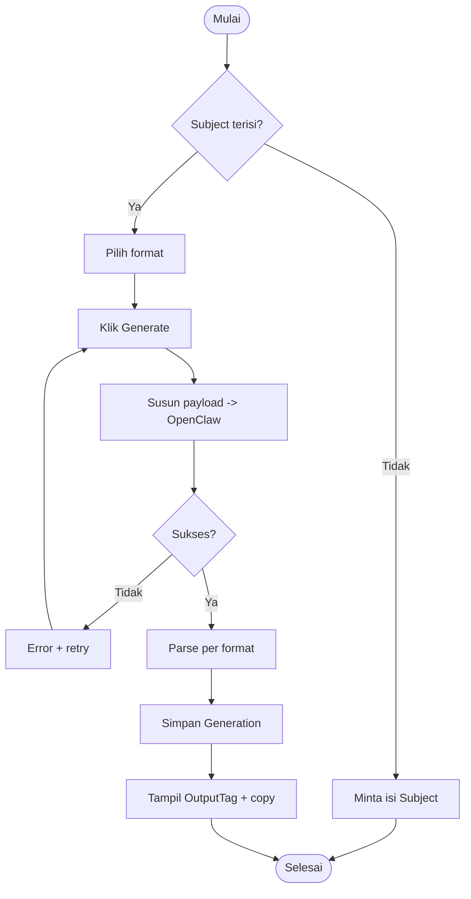

---

## UF-07: Generate Copywriting

| Atribut | Detail |
|---------|--------|
| **Actor** | Owner, Member |
| **Trigger** | Panel Copywriting → Generate |
| **Preconditions** | Login; Brand Profile + Subject |
| **Post Conditions** | Hook/caption/CTA/hashtag tampil |

### Main Flow
| Step | Actor | Aksi |
|------|-------|------|
| 1 | User | Pilih goal (organik/ads) |
| 2 | User | Klik Generate |
| 3 | Sistem | OpenClaw → JSON (hooks, caption, ctas, hashtags) |
| 4 | Sistem | Render tiap bagian + tombol copy |
| 5 | User | (opsional) Klik "Humanize semua" → UF-08 |

### Mermaid Flowchart
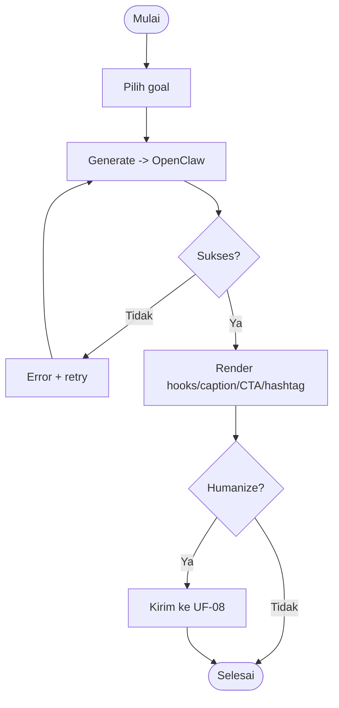

---

## UF-08: Humanize Copy

| Atribut | Detail |
|---------|--------|
| **Actor** | Owner, Member |
| **Trigger** | Panel Humanize / tombol "Humanize semua" |
| **Preconditions** | Login; ada copy input |
| **Post Conditions** | Versi natural tampil |

### Main Flow
| Step | Actor | Aksi |
|------|-------|------|
| 1 | User | Tempel copy / terima dari Copywriting |
| 2 | User | Klik Bikin Natural |
| 3 | Sistem | OpenClaw humanize (baca voice profile) |
| 4 | Sistem | Tampil hasil + toggle before/after |

### Validation Rules
| Field | Rule |
|-------|------|
| Copy | Wajib, tidak kosong |

### Mermaid Flowchart
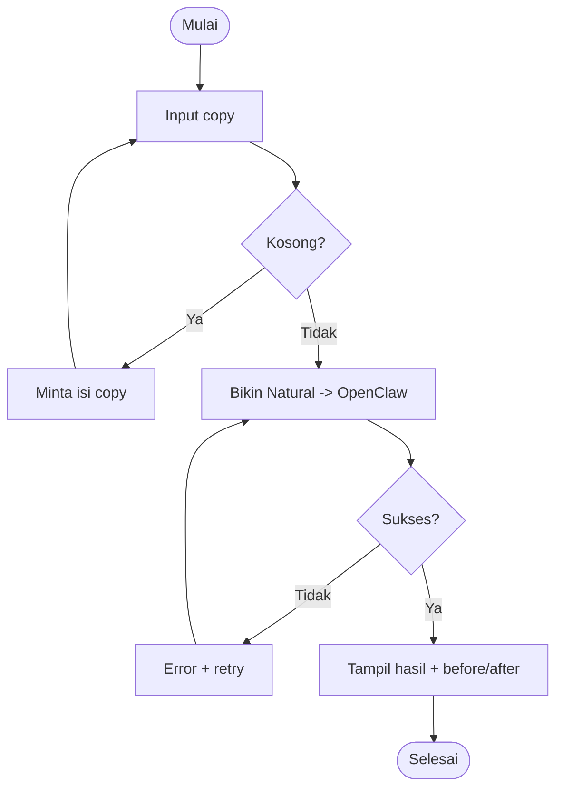

---

## UF-09: Content Drop (Orchestrator)

| Atribut | Detail |
|---------|--------|
| **Actor** | Owner, Member |
| **Trigger** | Klik "Drop Konten" |
| **Preconditions** | Login; Subject terisi |
| **Post Conditions** | Content Pack tersimpan & tampil |

### Main Flow
| Step | Actor | Aksi |
|------|-------|------|
| 1 | User | Klik Drop Konten |
| 2 | Sistem | Enqueue job BullMQ |
| 3 | Sistem | Chain: brief → copy → humanize → ads-generate |
| 4 | Sistem | Simpan ContentPack (status processing→done) |
| 5 | UI | Poll/SSE status → tampil pack saat done |

### Exception Flow
| Kode | Kondisi | Aksi |
|------|---------|------|
| E1 | Salah satu skill gagal | Status error + retry pack |

### Mermaid Flowchart
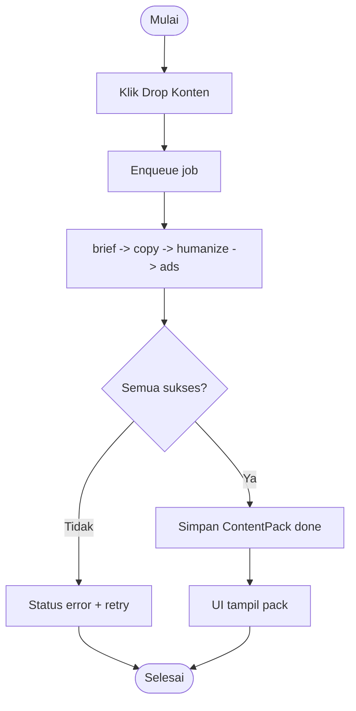

---

## UF-10: Generate Ad Variant

| Atribut | Detail |
|---------|--------|
| **Actor** | Owner, Member |
| **Trigger** | Panel Ads → Generate 4 variant |
| **Preconditions** | Login; Subject |
| **Post Conditions** | 4 ad concept tampil sebagai cards |

### Main Flow
| Step | Actor | Aksi |
|------|-------|------|
| 1 | User | Klik Generate 4 variant |
| 2 | Sistem | OpenClaw ads-generate → JSON array 4 |
| 3 | Sistem | Render 4 cards (scarcity/price/styling/social proof) |

### Mermaid Flowchart
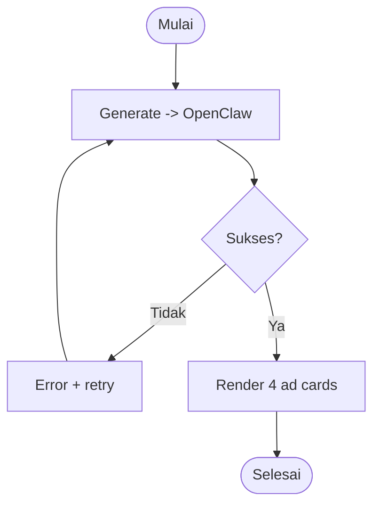

---

## UF-11: Ads Performance Review

| Atribut | Detail |
|---------|--------|
| **Actor** | Owner, Member |
| **Trigger** | Tab Performa |
| **Preconditions** | Login; kredensial Meta/TikTok terpasang |
| **Post Conditions** | Klasifikasi winner/ok/loser tampil (read-only) |

### Main Flow
| Step | Actor | Aksi |
|------|-------|------|
| 1 | User | Pilih range tanggal |
| 2 | Sistem | Tarik metrik Meta/TikTok (read-only) |
| 3 | Sistem | Klasifikasi + rekomendasi scale/pause |
| 4 | User | (opsional) Ajukan aksi → UF-12 |

### Mermaid Flowchart
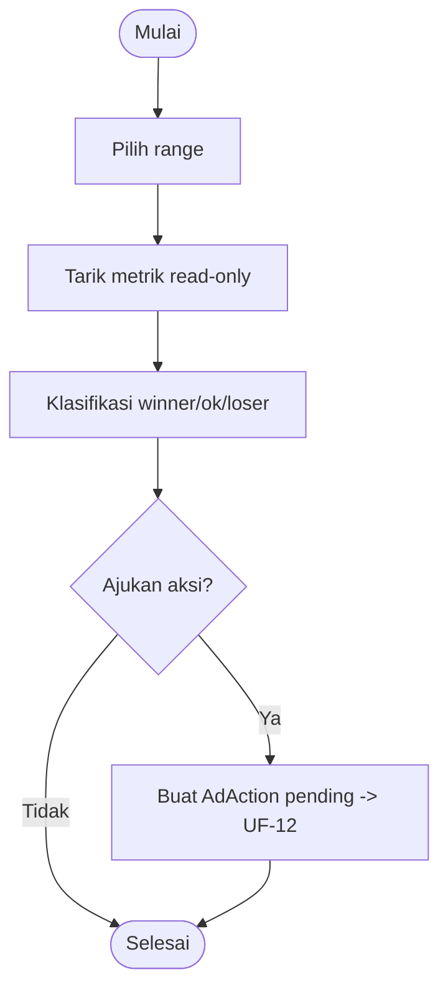

---

## UF-12: Approve Ad Action

| Atribut | Detail |
|---------|--------|
| **Actor** | Owner |
| **Trigger** | Ada AdAction pending_approval |
| **Preconditions** | Login sebagai Owner |
| **Post Conditions** | Aksi tereksekusi & tercatat |

### Main Flow
| Step | Actor | Aksi |
|------|-------|------|
| 1 | Owner | Buka aksi pending |
| 2 | Owner | Review rencana (budget/target) |
| 3 | Owner | Klik Approve |
| 4 | Sistem | Cek budget naik >30%? konfirmasi ulang |
| 5 | Sistem | Eksekusi write Meta/TikTok |
| 6 | Sistem | Status executed + audit |

### Exception Flow
| Kode | Kondisi | Aksi |
|------|---------|------|
| E1 | Budget naik >30% | Konfirmasi ulang dulu |
| E2 | Bukan Owner | Tombol Approve tidak tersedia |
| E3 | Eksekusi API gagal | Status tetap approved + tampil error |

### Mermaid Flowchart
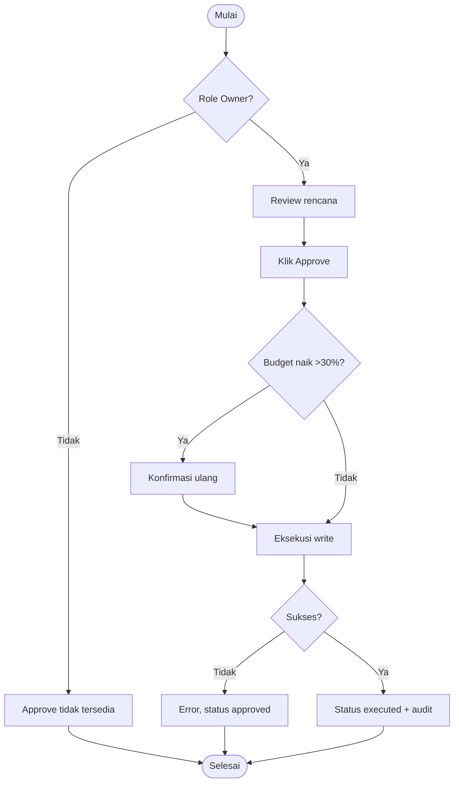

---

## UF-13: Connect Social Account

| Atribut | Detail |
|---------|--------|
| **Actor** | Owner |
| **Trigger** | Settings → Social Accounts → Connect |
| **Preconditions** | Login sebagai Owner; Brand Profile dipilih |
| **Post Conditions** | Akun ter-connect, token encrypted (tokenRef) |

### Main Flow
| Step | Actor | Aksi |
|------|-------|------|
| 1 | Owner | Pilih platform (IG/TikTok) |
| 2 | Owner | Jalankan OAuth flow |
| 3 | Sistem | Simpan token encrypted → tokenRef; simpan SocialAccount |
| 4 | Sistem | Audit SOCIAL_ACCOUNT_CONNECTED |

### Exception Flow
| Kode | Kondisi | Aksi |
|------|---------|------|
| E1 | OAuth ditolak/gagal | Error, tidak simpan |
| E2 | Bukan Owner | Akses ditolak |

### Mermaid Flowchart
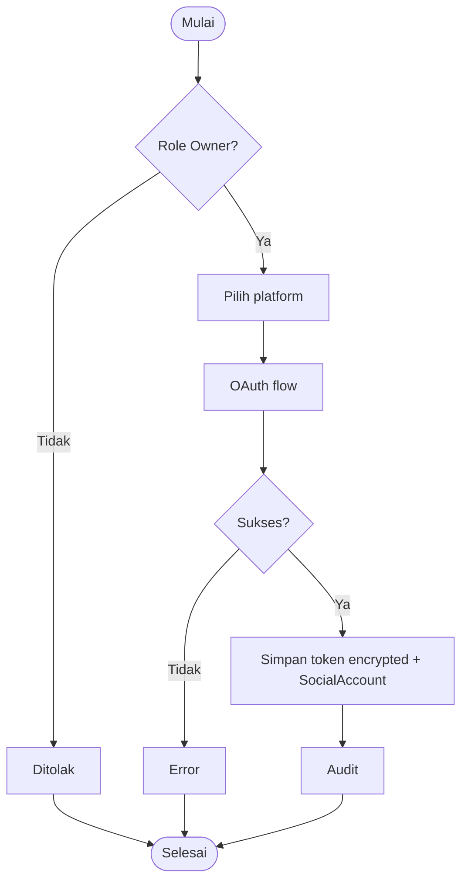

---

## UF-14: Lihat Social Performance

| Atribut | Detail |
|---------|--------|
| **Actor** | Owner, Member |
| **Trigger** | Insights → Social Performance |
| **Preconditions** | Login; akun ter-connect di Brand Profile aktif |
| **Post Conditions** | Metrik tampil |

### Main Flow
| Step | Actor | Aksi |
|------|-------|------|
| 1 | User | Buka panel, pilih platform (IG/TikTok) + range |
| 2 | Sistem | Cek SocialSnapshot cache |
| 3 | Sistem | Jika stale → tarik IG Graph/TikTok API → normalize → cache |
| 4 | Sistem | Tampil followers/reach/engagement + top posts |

### Alternative Flow
| Kode | Kondisi | Aksi |
|------|---------|------|
| A1 | Belum ada akun connect | Empty state: "Connect akun dulu" (arahkan Owner) |

### Mermaid Flowchart
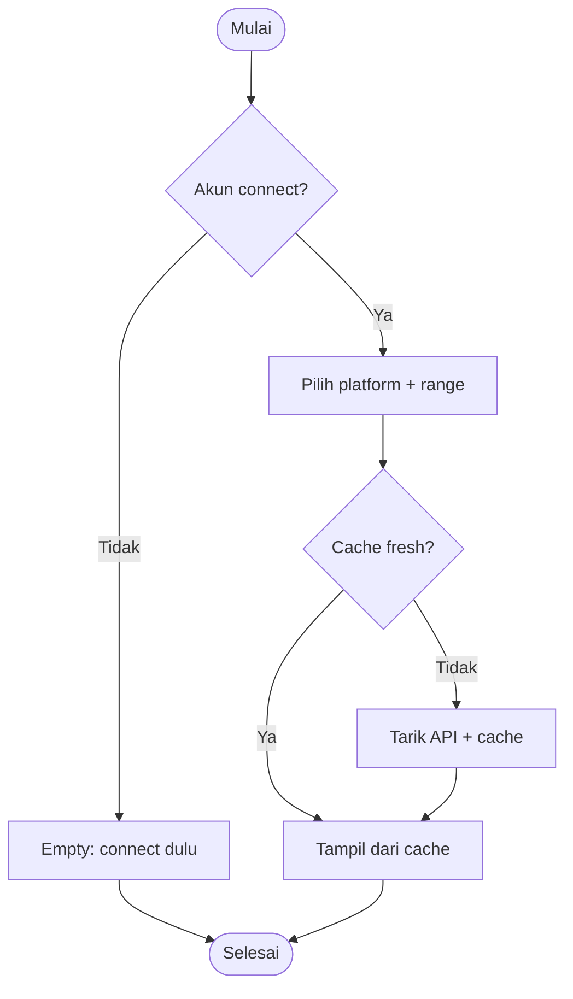

---

## UF-15: Lihat Revenue (Ginee)

| Atribut | Detail |
|---------|--------|
| **Actor** | Owner, Member |
| **Trigger** | Insights → Revenue |
| **Preconditions** | Login; kredensial Ginee terpasang |
| **Post Conditions** | Revenue tampil + delta + anomali |

### Main Flow
| Step | Actor | Aksi |
|------|-------|------|
| 1 | User | Pilih tanggal |
| 2 | Sistem | Cek RevenueSnapshot cache |
| 3 | Sistem | Jika stale → tarik order Ginee (skip Cancelled/Returned) |
| 4 | Sistem | Agregasi by channel + hitung delta |
| 5 | Sistem | Tampil metrik + badge anomali |

### Exception Flow
| Kode | Kondisi | Aksi |
|------|---------|------|
| E1 | Ginee gagal/timeout | Tampil cache terakhir + notice + retry |

### Mermaid Flowchart
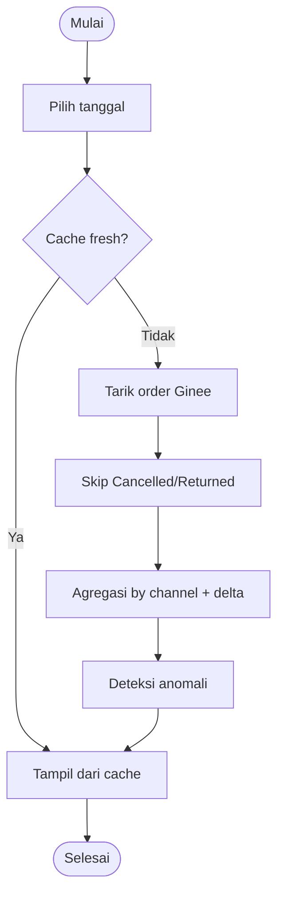

---

## Requirement Log
| Flow | Referensi SRS | Status |
|------|---------------|--------|
| UF-01..02 | AUTH-01..04 | Baseline |
| UF-03 | USER-01 | Baseline |
| UF-04..05 | BRAND-*, SUBJ-* | Baseline |
| UF-06..09 | CRE-01..05 | Baseline |
| UF-10..12 | ADS-01..04 | Baseline |
| UF-13..14 | SOC-01..03 | Baseline |
| UF-15 | REV-01..03 | Baseline |
